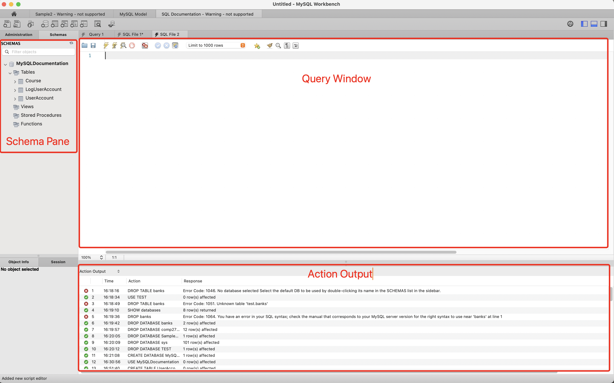

# Introduction

In this user documentation, we will be using [MySQL WorkBench](https://www.mysql.com/products/workbench/){:target="_blank"}, an integrated development environment (IDE) for MySQL to systematically guide users through the process of writing commonly-used SQL statements. Our objective is to provide a clear and concise tutorial on how to write SQL commands, equipping developers with the necessary skills to manage databases efficiently within MySQL Workbench.

## Background

Structured Query Language (SQL) is a programming language that provides a set of commands that allow users to manage and manipulate relational databases. [MySQL](https://www.mysql.com/){:target="_blank"} is a popular relational database management system (RDBMS) that implements the SQL language. Some of the operations that a user can do include querying, updating, inserting, and deleting data from tables. 


## Intended Users
This documentation is targeted towards the following users:

- Beginner-level developers who needs a step-by-step guide on writing SQL commands.
- Analysts requiring SQL for conducting data processing tasks.

## Prerequisite Knowledge
This guide assumes that you have the following:

- Introductory knowledge of MySQL - know how to connect to a MySQL server and how to run commands
- Introductory knowledge of SQL - know the fundamentals such as SQL datatypes

## Software Requirements
Please ensure you have the following before proceeding with the guide:

- **Operating System (OS):** MacOS or Windows
- **Relational Database Management System (RDBMS)**: [MySQL](https://dev.mysql.com/downloads/mysql/){:target="_blank"}
- **Integrated Development Environment (IDE):** [MySQL WorkBench](https://dev.mysql.com/downloads/workbench/){:target="_blank"}

## Procedures Overview
The three primary tasks utilizing SQL operations covered in this guide includes:

- Manage a **TABLE**
- Join tables into a **VIEW**
- Create and drop a **TRIGGER**

## MySQL WorkBench Layout

The following screenshot shows the areas of MySQL WorkBench that we will be referring to:




## Typographical Conventions

Throughout this user documentation, we will use the following layout and elements to provide relevant information.

### Placeholder

- Whenever you see `< Placeholder >`, please replace this with your own information. 
- ```...``` Means there can be a variable number of elements.


### Code Block
```
This is a code block that contains the code you should input into your query window 
```

### Additional information
> This provides additional information.


### Admonitions
!!! warning
    Specifies an action that requires caution before proceeding.
!!! note
    Includes important reminder.
!!! success
    Provides an image showing what should be expected.
    

