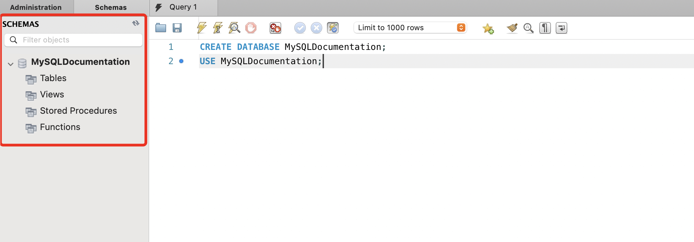
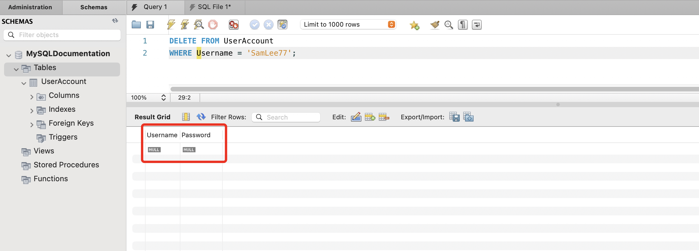

# Manage a TABLE

## Overview
SQL is the most commonly used programming language when managing relational database. In relational databases, all data are organized into tables, which are structured collections of rows and columns. Therefore, it is important to first learn the basis of how to manage relational databases, which includes tasks such as creating, inserting, deleting, and dropping tables.

## Set up a database
Before getting started, we will need to create a database to store tables.

1. To create a new database, input the following code in the query window and execute it:

    ``` sql
    CREATE DATABASE <DatabaseName>;    
    ```

    !!! note
        Click the refresh button to see your database appear on the Schema pane.

2. After creating the database, make sure you select that database and use it. 
``` sql
USE <DatabaseName>;
```
    At this point, you should see that a database has been made. 

    !!! success
        { align=left }

## Create a table
Once you have created a database, you can create and put a new table inside the database. 

1. Type the command below to create a table.
``` sql
CREATE TABLE <TableName>        
(<ColumnName> DATATYPE,         
 <ColumnName> DATATYPE,         
 <ColumnName> DATATYPE, ...);
```

    !!! note
        Click the refresh button to see your table under the database in the Schema pane.

2. 

    At this point, you should see the new table.

    !!! success
        

## Insert a tuple into a table
After creating a table, you can populate the table with data.

1. To insert a tuple into a table, use the following command:
``` sql
INSERT INTO <TableName> (<ColumnName1>, <ColumnName2>, <ColumnName3>, ...) 
VALUES (<Value1>, <Value2>, <Value3>, ...); 
```
    - The ```INSERT INTO``` command is used to specify the name of the table you are inserting into.
    - ```VALUES``` specifies the list of values that corresponding to the respective columns listed above.
    !!! note
        Ensure that the values you are inserting into the columns are of the correct datatype.


2. Verify that the insertion was made correctly by running the following command.  You should see the new row in the table.

    ``` sql
    SELECT * FROM <TableName>;
    ```

    - The ```SELECT``` command chooses which columns to include in the returned table.
    - The ```*``` symbol means to include all records.
    - The ```FROM``` command tells SQL which table to query from.

    !!! success
        

## Update a table record
1. In the scenario that you wish to make a change to a record, you can run the following command:
``` sql
UPDATE <TableName>
SET <ColumnName1> = <Updated Value>, ...
WHERE <ColumnName2> = <Original Value>;
```
    - The ```UPDATE``` keyword indicates that you would like to make changes to an existing table.
    - The ```SET``` keyword specifies which column you wish to change.
    - The ```WHERE``` keyword is used to extract only the records that fulfill the specified condition.

2. Verify that the correct update was made using the same command in [Insert a tuple into a table Step 2](task1.md#insert-a-tuple-into-a-table). You should see the new changes in the updated table.

    !!! success
        

## Delete a table record

1. In order to delete a table record, run the following command.
``` sql
DELETE FROM <TableName>
WHERE <condition>;
```
    - The ```DELETE FROM``` keyword specifies which table you would like to delete records from.
    - The ```WHERE``` clause specifies the conditions that must be met before the record is deleted.

    !!! warning
        If you use the DELETE FROM clause without using in junction with the WHERE clause, all the rows in the table will be deleted.

2. Verify the correct deletion was made. You should see that the record has been deleted.

    !!! success
        


## Drop a SQL table
Finally, We will go over how to drop an entire SQL table. 

1. Run the following command to drop an entire table.
``` sql
DROP TABLE <TableName>;
```

    !!! success
        


## Conclusion
By the end of this section, you will have learned the SQL commands for the following:

- [x] Understanding what SQL is and how its applied
- [x] Setting up a database
- [x] Creating a SQL table
- [x] Inserting a tuple into a table
- [x] Updating a table record
- [x] Deleting a table record
- [x] Dropping SQL table


