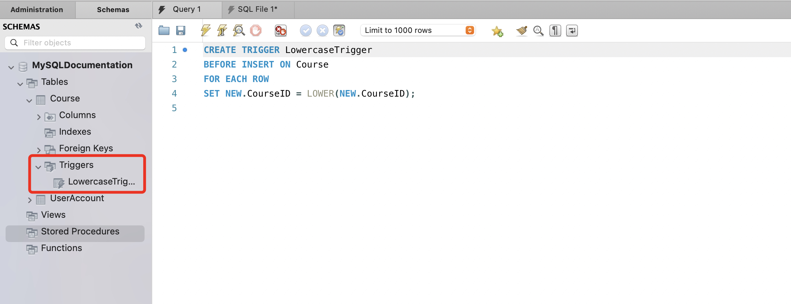
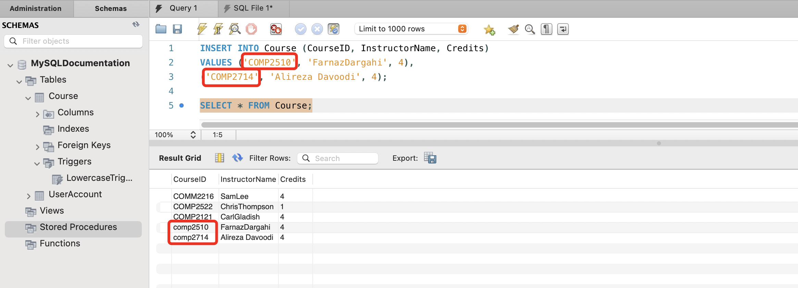
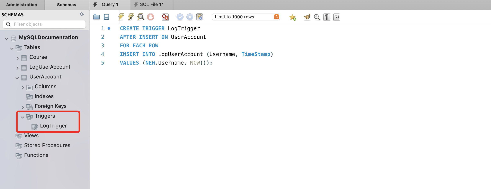
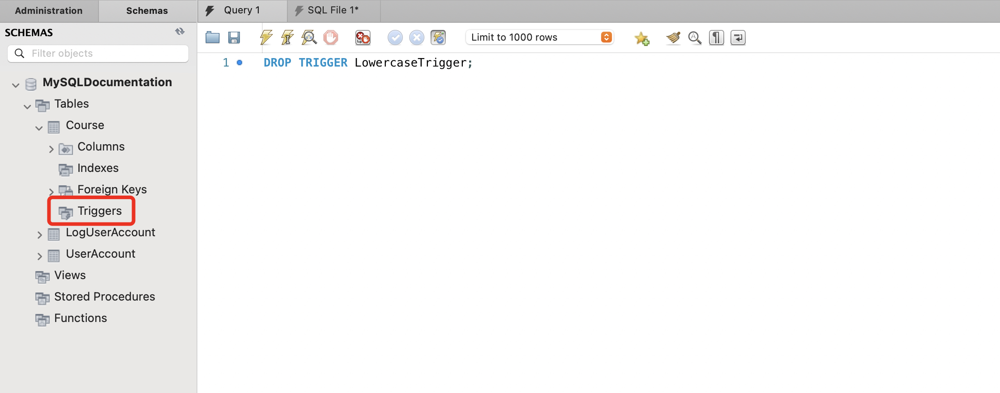

# Create and drop a TRIGGER

## Overview
Triggers are special types of stored procedures that automatically executes or fires in response to certain events on a table or view in a database. Understanding how to create and manage triggers is essential for implementing complex business logic directly on the database level to ensure data integrity. It is also used to automate tasks such as auditing changes, enforcing constraints, or updating related tables. 


## Set up tables for adding a trigger
Before you create a trigger, it is important to set up your tables properly.

1. Follow instructions in [Create a TABLE](task1.md#create-a-table){:target="_blank"} to create some tables and insert data into them.


## Create a trigger
Creating a trigger involves specifying the timing (`BEFORE` or `AFTER` the event), the event (`INSERT`, `UPDATE`, or `DELETE`) that triggers it, and the operations to be performed. We will cover two of the most common types of SQL triggers: **BEFORE INSERT** and **AFTER INSERT**.

### BEFORE INSERT
1. Execute the command below to create a trigger:
    ``` sql
    CREATE TRIGGER <TriggerName>
    BEFORE INSERT ON <TableName>
    FOR EACH ROW
    -- Trigger logic goes here
    ```

    > An example of the ```Trigger logic``` could be:
    ``` sql
    SET NEW.<ColumnName> = LOWER(NEW.<ColumnName>);
    ```

    !!! success
        

2. Verify the trigger by performing the action it is designed to respond to.

    > For example, after setting up a `BEFORE INSERT` trigger which converts a column's data to lowercase before insertion, you can test the trigger's functionality by attempting to insert a record into the designated table using uppercase letters in the targeted column. Execute the following command to observe the trigger in action:
    ``` sql
    INSERT INTO <TableName> (<ColumnName>, ...)
    VALUES ('UPPERCASE Value', ...);
    ```

3. Verify that the correct data has been inserted by running the following command for the table updated in step 2. 
    ``` sql
    SELECT * FROM <TableName>;
    ```

    !!! success
        

### AFTER INSERT
1. Execute the command below to create a trigger:
    ``` sql
    CREATE TRIGGER <TriggerName>
    AFTER INSERT ON <TableName>
    FOR EACH ROW
    -- Trigger logic goes here

    ```

    > An example of trigger logic could be:
    ``` sql
    INSERT INTO <LogTableName> (<ForeignKeyColumn>, <TimestampColumn>)
    VALUES (NEW.<ForeignKeyValue>, NOW());
    ```
    !!! note
        For this example, ensure you have created a log table named `<LogTableName>` alongside your main table `<TableName>`. For guidance on creating a new table, please refer to [Create a TABLE](task1.md#create-a-table){:target="_blank"}.


    !!! success
        

2. Verify the trigger by performing the action it is designed to respond to.

    > For example, after setting up a `AFTER INSERT` trigger which logs a record in the log table after insertion, you can test the trigger's functionality by attempting to insert a record into the designated table and note the change in the log table. Execute the following command to observe the trigger in action:
    ``` sql
    INSERT INTO <TableName> (<ColumnName>, ...)
    VALUES ('anything', ...);
    ```

3. Verify that a log record has been created successfully by running the following command for the log table. 
    ``` sql
    SELECT * FROM <LogTableName>;
    ```

    !!! success
        

## Drop a trigger
Finally, We will go over how to drop the trigger. 

1. Run the following command to drop the trigger in database.
    ``` sql
    DROP TRIGGER <TriggerName>;
    ```

    !!! success
        


2. Repeat step 2 and 3 from [BEFORE INSERT](#before-insert) or [AFTER INSERT](#after-insert) to verify if trigger has been dropped.

    !!! success
        

## Conclusion
By the end of this section, you have gained knowledge on the following tasks:

- [x] Understanding the purpose and functionality of triggers
- [x] Creating BEFORE INSERT triggers
- [x] Creating AFTER INSERT triggers
- [x] Dropping triggers
